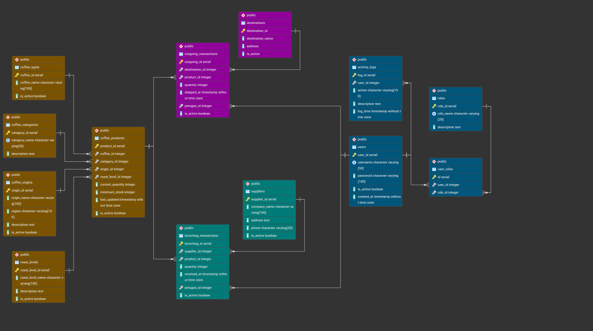
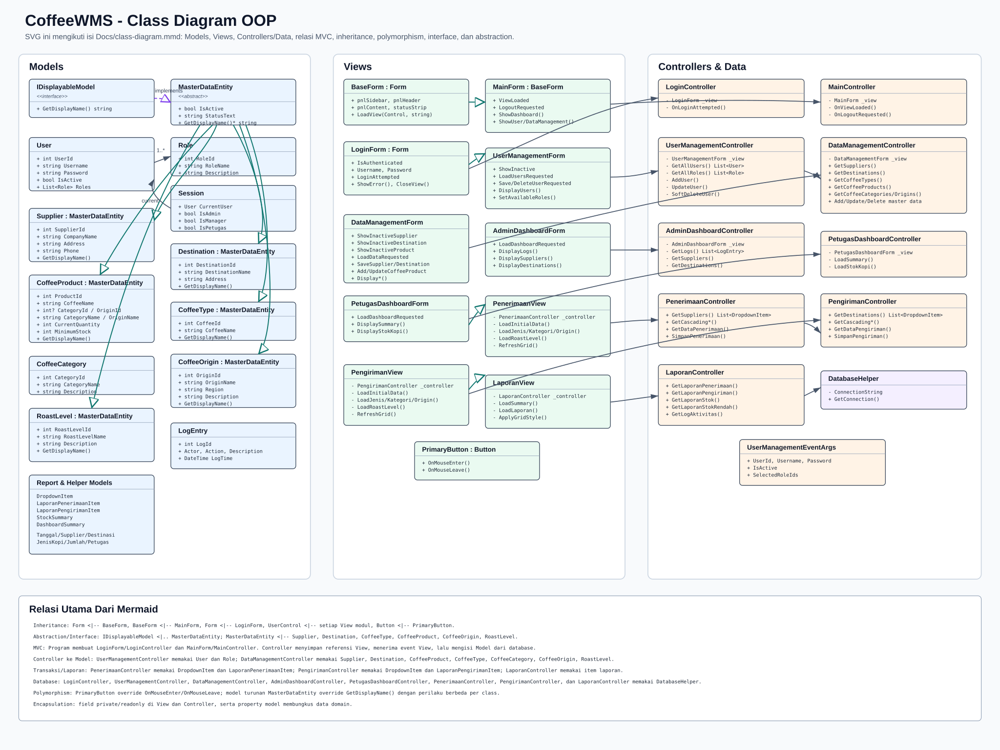

# CoffeeWMS

## Cara Menambahkan Menu di Sidebar / Dashboard
Mint akuh gapake Visual Studio dawg. kalau mau buat pake kode gini ya

1. Buka file `Views/MainForm.cs`.
2. Cari metode `InitializeMenus()`.
3. pake metode `AddMenuItem()` buat nambahin tombol baru.
4. Tambahin `currentTop += 40;` di baris selanjutnya buat ngasih jarak (margin) ke bawah.

**Contoh Penulisan:**
```csharp
// nambahin menu Stok Barang
AddMenuItem("📦 Stok Barang", currentTop, ShowStokBarang);
currentTop += 40; // ngasih jarak (margin) ke bawah.
```

---

## How to Contribute

Biar gak conflict, ikuti alur Git sederhana berikut:

```bash
# 1. Sinkronisasi dengan main terbaru
git checkout main
git pull origin main

# 2. Buat dan masuk ke branch fitur baru
git checkout -b nama-branch-fitur-anda

# 3. (Lakukan perubahan/kodingan di sini)

# 4. Simpan perubahan ke Git (Commit)
git add .
git commit -m "Pesan commit singkat"

# 5. Tarik perubahan terbaru dulu sebelum push (mencegah konflik)
git pull origin main

# 6. Push kode terbaru ke branch Anda
git push origin nama-branch-fitur-anda
```

Setelah selesai, buat **Pull Request** via web repositori Anda (GitHub/GitLab). Biarkan Admin yang menyetujui (Approve).

---

## How to Run

1. Buka Folder `Database` dan paste Final.sql ke database (jangan lupa set path user sm db nya cuy).
2. Copy, paste dan sesuaikan koneksi DatabaseHelpers.example.txt ke `CoffeeWSM/Data/Helpers/DatabaseHelpers.cs`.
3. Run Program.
4. Login Admin adalah Username: Admin, Password: Admin123.

---

## Documentation

Dokumentasi gambar arsitektur dan database dari sistem CoffeeWMS:

### Entity Relationship Diagram (ERD)


### Class Diagram

